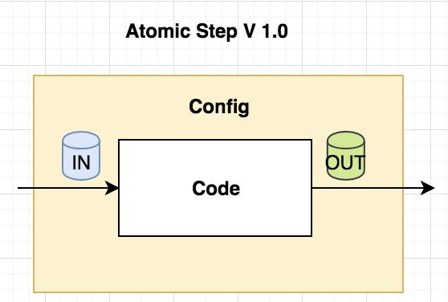
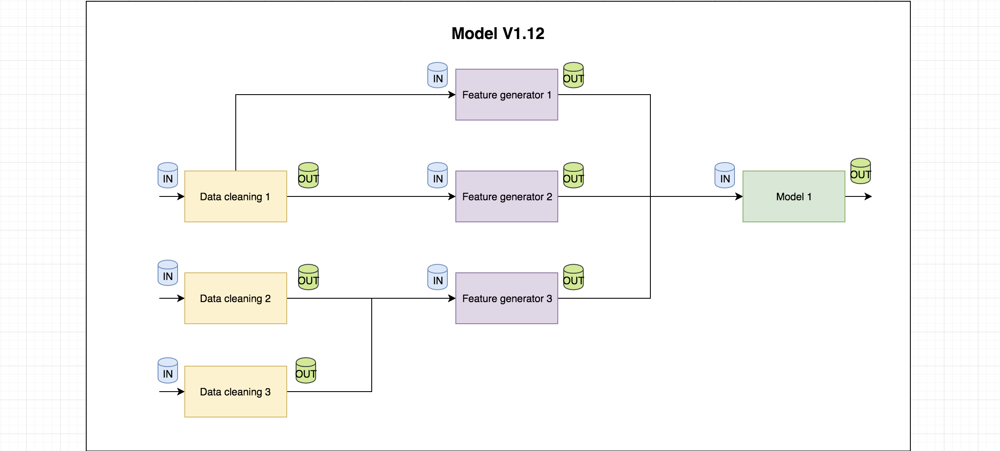

# Reproducible Machine Learning

## About this repo

This repository contains a list of articles about reproducible machine learning.

This repository was proposed and is primarily maintaned by <a href="https://twitter.com/akarve">Aneesh Karve</a>, CTO and co-founder of <a href="https://quiltdata.com/">QuiltData</a>.

## What is reproducible machine learning?

Reproducible machine learning is generally defined as the ability to abstract your machine learning operations into atomic computations consisting of its constituent parts. Reproducibility also deals with concepts such as versioning, abstraction of ML libraries, containerisation, and beyond.

<table>
  <tr>
    <td width="50%">
        <h2>Reproducible Step</h2>
        
    </td>
    <td width="50%">
        <h2>Reproducible Graph</h2>
        
    </td>
  </tr>
</table>

## Articles

* [Reproducible Machine Learning with Jupyter and Quilt](https://blog.dominodatalab.com/reproducible-machine-learning-with-jupyter-and-quilt/) - Tutorial on quilt to introduce reproducible machine learning through a simple function: code + data + model = reproducible ML <a href="https://twitter.com/akarve">Aneesh Karve</a>, CTO and co-founder of <a href="https://quiltdata.com/">QuiltData</a>

